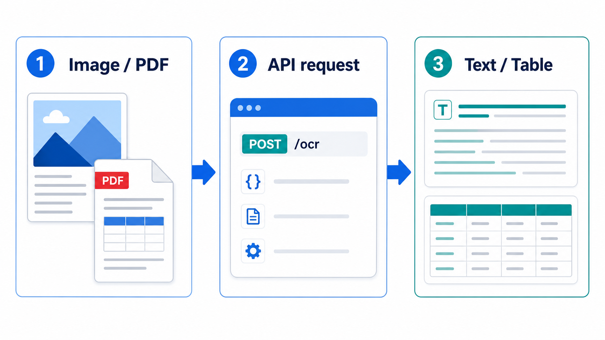

[](https://github.com/neozhu/PaddleOCRFastAPI/actions/workflows/docker-publish.yml)
[](https://github.com/neozhu/PaddleOCRFastAPI/actions/workflows/python-build.yml)

# PaddleOCRFastAPI

[中文文档](./README_CN.md)

A practical FastAPI service for image OCR, PDF table extraction, and table recognition from images or PDFs. The current dependency set uses PaddleOCR 3.7.0, PaddleX OCR 3.7.1, and PaddlePaddle 3.2.0. OCR uses the lightweight PP-OCRv6 detection and recognition models.

The Docker image is based on Python 3.12.



## Features

- Image OCR from file upload, URL, Base64 data, or a local path.
- Table recognition from an uploaded image/PDF or a public image/PDF URL.
- Table extraction from uploaded or public PDFs.
- JSON, HTML, or XLSX output for the table-recognition endpoints.
- Interactive OpenAPI documentation at `/docs`.

## Quick start

### Run locally

Use Python 3.9 or later; Python 3.12 matches the Docker image.

```shell
git clone https://github.com/neozhu/PaddleOCRFastAPI.git
cd PaddleOCRFastAPI

python -m venv .venv
# Linux/macOS
source .venv/bin/activate
# Windows PowerShell
# .\.venv\Scripts\Activate.ps1

pip install -r requirements.txt
uvicorn main:app --host 0.0.0.0 --port 8000
```

Open <http://localhost:8000/docs> to try the API. PaddleOCR models may be downloaded when an endpoint is first used, so the first request can take longer than subsequent requests.

### Run with Docker Compose

```shell
git clone https://github.com/neozhu/PaddleOCRFastAPI.git
cd PaddleOCRFastAPI
docker compose up --build -d
docker compose logs -f
```

The Compose configuration exposes port `8000` and persists downloaded PaddleX models in the `paddleocr_models` Docker volume.

## API examples

All examples assume the service is running at `http://localhost:8000`.

### OCR an uploaded image

`POST /ocr/predict-by-file` accepts `jpg`, `jpeg`, `png`, `bmp`, and `tiff` files through the multipart field `file`.

```shell
curl -X POST "http://localhost:8000/ocr/predict-by-file" \
  -F "file=@./receipt.png"
```

The result contains recognized text and its bounding boxes:

```json
{
  "resultcode": 200,
  "message": "receipt.png",
  "data": [
    {
      "input_path": "...",
      "rec_texts": ["Example text"],
      "rec_boxes": [[12, 20, 180, 54]]
    }
  ]
}
```

### OCR a public image URL

`GET /ocr/predict-by-url` uses the query parameter `imageUrl`.

```shell
curl -G "http://localhost:8000/ocr/predict-by-url" \
  --data-urlencode "imageUrl=https://example.com/receipt.png"
```

Other image OCR endpoints are `GET /ocr/predict-by-path` (`image_path`) and `POST /ocr/predict-by-base64` (`{"base64_str":"..."}`). Local paths are resolved by the server, so use that endpoint only for files available to the running service.

### Recognize the first table in an image or PDF

`POST /table/predict-by-file` accepts an image or PDF through `file`. Select `json` (default), `html`, or `xlsx` using `format`.

```shell
curl -X POST "http://localhost:8000/table/predict-by-file?format=json" \
  -F "file=@./report.pdf"
```

For `format=json`, the response includes both the generated table HTML and simplified rows:

```json
{
  "resultcode": 200,
  "message": "Success",
  "data": {
    "html": "<table>...</table>",
    "rows": [["Header A", "Header B"], ["Value 1", "Value 2"]]
  }
}
```

`GET /table/predict-by-url` provides the same capability for a public `url` query parameter. It accepts image and PDF URLs.

### Extract tables from a PDF

`POST /pdf/predict-by-file` accepts a PDF through `file` and returns only pages where a table is found.

```shell
curl -X POST "http://localhost:8000/pdf/predict-by-file" \
  -F "file=@./report.pdf"
```

For a public PDF, use `GET /pdf/predict-by-url` with the `pdf_url` query parameter.

## Endpoint summary

| Endpoint | Purpose |
| --- | --- |
| `GET /ocr/predict-by-path` | OCR an image path visible to the server. |
| `POST /ocr/predict-by-base64` | OCR Base64 image data. |
| `POST /ocr/predict-by-file` | OCR an uploaded image. |
| `GET /ocr/predict-by-url` | OCR a public image URL. |
| `POST /table/predict-by-file` | Recognize the first table in an uploaded image or PDF. |
| `GET /table/predict-by-url` | Recognize the first table in a public image or PDF URL. |
| `POST /pdf/predict-by-file` | Extract tables from an uploaded PDF. |
| `GET /pdf/predict-by-url` | Extract tables from a public PDF URL. |

## Notes

- Table recognition requires the version-matched `paddlex[ocr]==3.7.1` dependency included in `requirements.txt`.
- Public URL endpoints require the server to be able to download the source file.
- The service is configured for CPU-compatible defaults. No GPU setup is included in this repository.

## License

PaddleOCRFastAPI is released under the [MIT License](./LICENSE).
